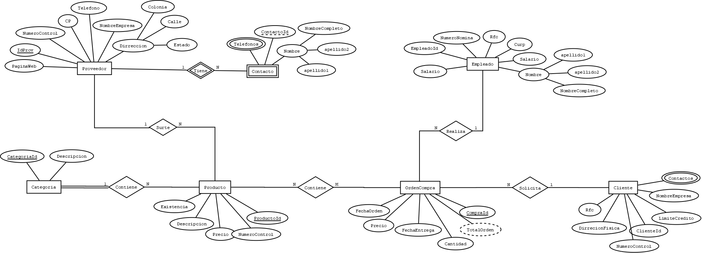

# Requerimientos

Una empresa encargada de las ventas de diferentes productos desea crear una base de datos que controle los proveedores, clientes, empleado, categorías de productos y órdenes de compra.
Para los proveedores se necesita almacenar un numero de control, nombre de la empresa, dirección que conta de (Numero, calle, colonia y estado), código postal, teléfono, página web, teléfono de contacto o contactos del proveedor (nombre del contacto, email del contacto).
Para tos empleados se desea almacenar un numero de nómina, nombre completo del empleado, RFC, CURP y salario (El salario no puede ser negativo y el máximo es de 65,000).
Para las órdenes de compra se necesita almacenar la fecha de la orden, el empleado que la realizo, al cliente que se le vende, la fecha de entrega y los diferentes productos que contiene.
El producto debe almacenar un numero de control, una descripción única, la existencia y un precio.
La categoría debe tener un identificador, nombre único de categoría.
La compra siempre deber tener un precio de venta que se obtiene del precio unitario del producto y una cantidad vendida.

# Diagrama Concptual E-R

# Diagrama Logico Relaciona

# Llenado de BD con SQL-LMD

# Consultas Simples

