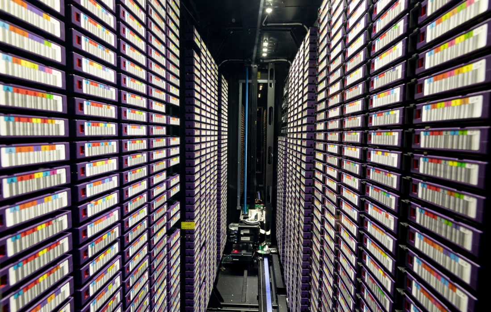

# Base de Datos para Aplicaciones

---

Este repositorio contiene información de base de datos referente a los siguientes temas:

1. Consultas con Joins (inner join, left join, rigth join y full join)
1. Views
1. Store Procedures
1. Triggres
1. Manejo de Transacciones
1. Despliegue de APlicaciones

[Definicion de Base de Datos](https://aws.amazon.com/es/what-is/database/)